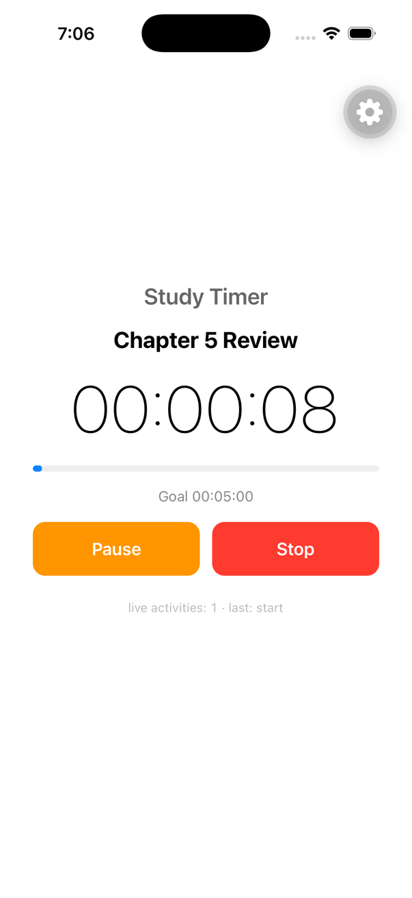
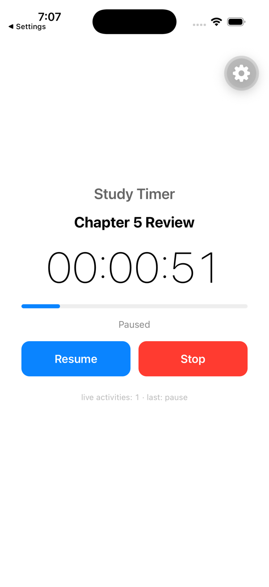
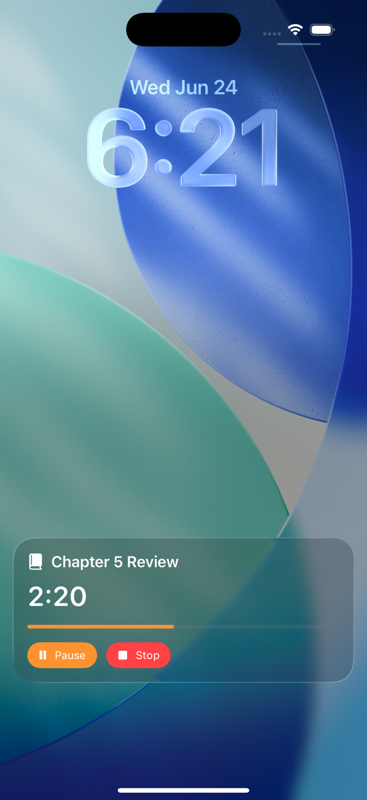
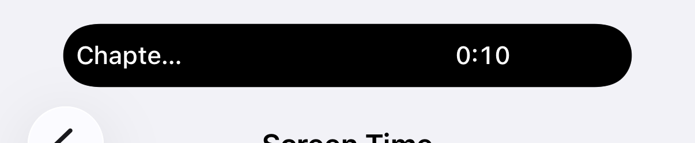
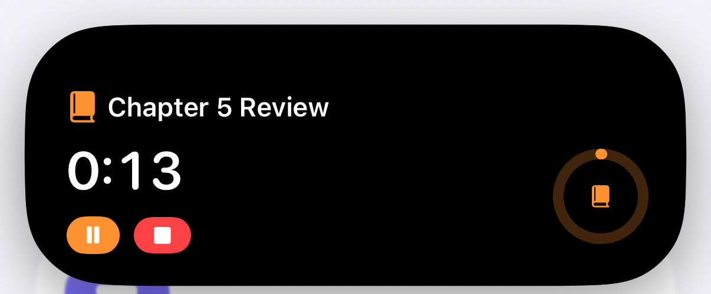
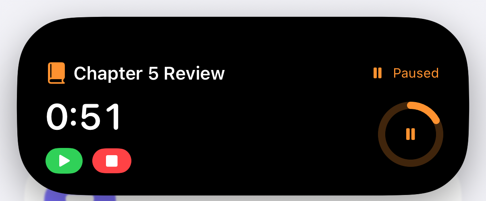

# Live Timer — Study Timer with iOS Live Activities

A React Native / **Expo** iOS study timer whose state is mirrored to a native iOS
**Live Activity** on the lock screen and **Dynamic Island**. The React Native app owns the
timer; a hand-written native bridge drives ActivityKit; a SwiftUI widget renders it.

- **App + bridge:** Expo (SDK 56) + React Native + TypeScript
- **Bridge:** a local Expo module (Swift) calling ActivityKit — hand-written, no prebuilt package
- **Widget:** Swift / SwiftUI Widget Extension (generated by `@bacons/apple-targets`)

> Visual architecture walkthrough: [`docs/architecture.html`](./docs/architecture.html) (open in a browser).
> Architecture rationale and trade-offs: see [`DISCUSSION.md`](./DISCUSSION.md).
> Engineering invariants/conventions: see [`CLAUDE.md`](./CLAUDE.md).

## Screenshots

### In-app (React Native)

The app owns the timer and displays it in `HH:MM:SS` (per spec), with Pause/Resume/Stop and a
goal progress bar.

| Running | Paused |
| --- | --- |
|  |  |

### Lock screen

The Live Activity shows the session name, elapsed time, goal bar, and interactive Pause/Stop —
tapping them controls the timer without opening the app.



### Dynamic Island

**Compact** — (truncated) session name + live time:



**Expanded** — full name, on-device ticking time, goal ring, and interactive Pause/Stop:

| Running | Paused |
| --- | --- |
|  |  |

**Minimal** — just elapsed time. Implemented and correct, but **not runtime-photographable on a
simulator**: iOS only renders the minimal presentation when 2+ Live Activities from _different
apps_ are active (multiple activities from the _same_ app collapse to a single compact view —
verified with three concurrent activities), and no stock simulator app ships a Live Activity to
pair with. It renders in isolation via the SwiftUI `#Preview`. See [`DISCUSSION.md`](./DISCUSSION.md).

## Prerequisites

- **macOS** with **Xcode 16+** (Live Activities need iOS 16.2+; Dynamic Island UI needs an
  iPhone **Pro** simulator, e.g. iPhone 15/16/17 Pro)
- **Node 18+** and **npm**
- **CocoaPods** (`sudo gem install cocoapods` or `brew install cocoapods`)
- **Watchman** recommended (`brew install watchman`)

This is a **development build**, not Expo Go — Live Activities require custom native code, which
Expo Go cannot load.

## Run it (simulator)

From the repo root:

```bash
# 1. Install JS dependencies
npm install

# 2. Generate the native iOS project (ios/ is gitignored and regenerated here)
npx expo prebuild -p ios --clean

# 3. Build + install + launch on an iOS simulator (pick an iPhone Pro for the Dynamic Island)
npx expo run:ios
```

The first build compiles React Native + the widget extension and takes several minutes.
`npx expo run:ios` starts Metro, builds, installs, and launches the app. To target a specific
simulator: `npx expo run:ios --device "iPhone 17 Pro"`.

## Using the app

1. Enter a **session name**, pick a **goal** (5 / 15 / 25 / 50 min), and tap **Start New Session**
   → a Live Activity appears.
2. The in-app timer counts up in **HH:MM:SS**; **Pause/Resume** and **Stop** control it. When it
   reaches the **goal** (default 5:00) the session **completes** — the clock stops at the goal and
   both the app and the Live Activity show **"Goal reached"** (this freeze happens on-device, so it
   still stops at the goal while backgrounded or killed).
3. **See the Live Activity:**
   - **Lock screen:** in the Simulator press **⌘L** (or _Device → Lock_) → the banner shows the
     session name, elapsed time, and progress bar.
   - **Dynamic Island:** leave the app (swipe to home / open another app). The compact pill shows
     the (truncated) session name + time; **long-press** it to see the expanded view (name, time,
     progress ring, and Pause/Stop controls).
4. **Pause** freezes the time and shows "Paused" in the app and the Live Activity; **Resume**
   continues; **Stop** removes the Live Activity.
5. **Control it from the Live Activity:** the Pause/Resume/Stop buttons on the lock screen and
   expanded Dynamic Island drive the timer via an App Intent — no need to open the app. When you
   return to the app it reconciles against the live activity, so its state stays in sync.

## Project structure

```
App.tsx                          RN screen (timer UI: start/pause/resume/stop)
hooks/useTimer.ts                timer state machine + startAnchor math
lib/format.ts                    HH:MM:SS / progress helpers
modules/study-timer/             hand-written Expo module (the RN <-> ActivityKit bridge)
  index.ts                       typed TS API the app calls
  index.android.ts / .web.ts     no-op stubs (Live Activities are iOS-only)
  src/StudyTimer.types.ts        shared TS types
  ios/StudyTimerModule.swift     ActivityKit: areEnabled/start/update/end/endAll/getActiveIds
  ios/StudyAttributes.swift      ActivityAttributes (synced copy — see CLAUDE.md)
targets/widget/                  SwiftUI Widget Extension (via @bacons/apple-targets)
  StudyLiveActivity.swift        lock screen + Dynamic Island (compact/expanded/minimal)
  StudyWidgetBundle.swift        @main widget bundle
  StudyAttributes.swift          ActivityAttributes (source of truth)
  expo-target.config.js          widget target config (frameworks, App Group)
app.json                         Expo config: bundle id, App Group, NSSupportsLiveActivities, plugin
```

`ios/` and `android/` are **generated** by `expo prebuild` and are gitignored. Don't edit them by
hand — edit the module/target source + `app.json`, then re-run prebuild.

## Running on a physical device (optional)

Simulator is sufficient for the full feature set. To run on a real iPhone:

1. Set your Apple **Team** in Xcode (open `ios/LiveTimer.xcworkspace` → Signing & Capabilities for
   **both** the app target and `StudyWidget`), or add `ios.appleTeamId` to `app.json`.
2. `npx expo run:ios --device` and select your iPhone.

A **free** Apple ID works for development installs; the **App Group** capability (used only by the
optional interactive-controls stretch) needs a **paid** account — the core timer does not require it.

## Troubleshooting

- **Dynamic Island not visible:** use an iPhone **Pro** simulator; the Dynamic Island only shows
  when the app is **not** in the foreground.
- **SwiftUI widget build oddities:** `xcrun simctl --set previews delete all`, then rebuild.
- **Changed native/config but nothing updated:** re-run `npx expo prebuild -p ios --clean`.
